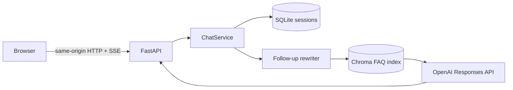

# SmartStore FAQ Assistant

A production-structured FastAPI RAG application for Korean NAVER SmartStore questions. It retrieves relevant FAQ evidence, rewrites context-dependent follow-ups without altering the original conversation, streams grounded answers from the OpenAI Responses API, and shows the retrieved sources in a responsive web interface.

This is an independent portfolio rebuild inspired by the behavior of [`eldor-fozilov/faq-chatbot`](https://github.com/eldor-fozilov/faq-chatbot). Its source code is not copied.

## What is included

- FastAPI and server-sent event streaming
- OpenAI Responses API generation and `text-embedding-3-small` retrieval embeddings
- cosine-similarity Chroma index with a reproducibility fingerprint
- secure anonymous sessions persisted in SQLite
- English interface, Korean questions and answers, and visible FAQ evidence
- safe raw-pickle validation followed by canonical JSONL normalization
- typed configuration, deterministic provider fakes, automated tests, CI, and Docker

## Architecture



The browser never receives an API key. Without `OPENAI_API_KEY`, the application stays healthy, reports itself as unconfigured, and displays safe server-side setup instructions instead of a chat composer.

## Requirements

- [`uv`](https://docs.astral.sh/uv/)
- Python 3.12 (managed automatically by `uv`)
- Docker 24+ for container verification
- An OpenAI API key only for real indexing and live answers

## Local setup

```bash
uv sync --all-groups
cp .env.example .env
uv run faq-chatbot
```

Open [http://localhost:8000](http://localhost:8000). With no key configured, the expected UI is the configuration screen.

Useful checks:

```bash
make check
make test
```

## Prepare the FAQ data

The raw dataset is not committed here. The CLI downloads the exact inspected file from reference commit `c5580aafb77a24485ccc59ebe0e79a25ad3289a5`, checks its size and SHA-256 digest, then saves it under the ignored `data/raw/` directory.

```bash
make data-download
make data-normalize
```

Expected raw SHA-256:

```text
93f2a92172f253b28ff94b6b8fd993b8cec1478e286ce7d6296098bd73a9e52b
```

After adding `OPENAI_API_KEY` to `.env`, build the real vector index:

```bash
make data-index
```

The build command writes a fingerprint containing the normalized data digest, embedding model, cosine metric, and schema version. A mismatched runtime configuration fails with an explicit rebuild message.

Evaluate retrieval after the live index exists:

```bash
make data-evaluate
```

## API

| Method | Path | Purpose |
| --- | --- | --- |
| `GET` | `/health/live` | Process liveness |
| `GET` | `/health/ready` | Provider and configuration readiness |
| `GET` | `/api/v1/config` | Safe readiness state and missing variable names |
| `POST` | `/api/v1/sessions` | Create an anonymous cookie session |
| `GET` | `/api/v1/sessions/current/messages` | Restore current-session history |
| `DELETE` | `/api/v1/sessions/current` | Delete the current session only |
| `POST` | `/api/v1/chat/stream` | Stream `sources`, `delta`, `completed`, and `error` SSE events |

Example stream request after creating a session:

```bash
curl -c cookies.txt -X POST http://localhost:8000/api/v1/sessions
curl -N -b cookies.txt \
  -H 'Content-Type: application/json' \
  -d '{"message":"스마트스토어센터 가입 절차는 어떻게 되나요?"}' \
  http://localhost:8000/api/v1/chat/stream
```

## Docker

```bash
docker compose build
docker compose up
```

SQLite and Chroma live in the named `faq-data` volume. The image runs as a non-root user and exposes a process health check. Public deployment should set `COOKIE_SECURE=true`, inject secrets through the hosting platform, and terminate TLS before the application.

## Verification

The normal test suite does not need network access or an OpenAI key:

```bash
uv run ruff check .
uv run ruff format --check .
uv run pyright
uv run pytest --cov-fail-under=85
uv run playwright install chromium
uv run python tests/browser_smoke.py
```

Before claiming live OpenAI functionality:

1. Add the key locally and build the real index.
2. Run `make data-evaluate` and record Recall@5 and MRR.
3. Test direct questions, paraphrases, follow-ups, out-of-scope input, and insufficient context.
4. Verify source display, cancellation, timeout handling, and restored sessions in the browser.
5. Tune retrieval thresholds only from recorded evaluation results.

## Security, privacy, and limitations

- Anonymous session tokens are random; only their SHA-256 hashes are stored.
- Sessions have a sliding 24-hour expiry and session-scoped deletion.
- The app is same-origin by default and does not enable permissive CORS.
- OpenAI, network, and retrieval failures are mapped to safe public errors.
- Retrieved FAQ text is treated as untrusted evidence, not as instructions.
- The source dataset may contain stale policy language or scraped UI boilerplate.
- The dataset's license and redistribution permissions are unverified. Do not publish or redistribute it until provenance and permissions are confirmed.
- User accounts, admin tools, analytics, public hosting, and distributed state are intentionally out of scope.

See [`plans.md`](plans.md) for the implementation gates and deferred live-verification checklist.
