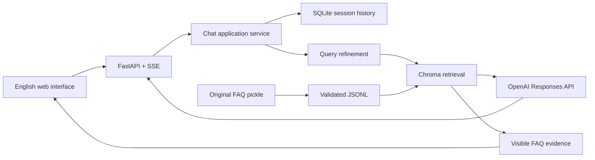

# FAQ Chatbot Portfolio Rebuild

## Summary

Build an independent, production-structured FAQ RAG application inspired by the reference repository. The result will be locally verified, Docker-ready, and suitable for a portfolio, but not publicly deployed.

Locked decisions:

- [x] Deliver locally verified and deployment-ready.
- [x] Use one FastAPI application serving a polished vanilla JavaScript interface.
- [x] Rebuild cleanly while correcting the reference architecture and bugs.
- [x] Include typed models, reproducible indexing, tests, proper errors, and correct conversation handling.
- [x] Operate without an API key through deterministic test doubles; the UI shows a configuration screen.
- [x] Run a live OpenAI smoke test later, after the user adds the key locally.
- [x] Preserve the source pickle only as raw input and convert it into validated records.
- [x] Use English interface text with Korean example questions and Korean chatbot answers.
- [x] Use secure anonymous cookies, session-scoped reset, expiry, and rate limits.
- [x] Use GPT-5.6 Terra as the Codex implementation model, not as a chatbot runtime requirement.

## Phase 0 — Record and scaffold

- [x] Create a Python 3.12 `src`-layout project managed by `uv`.
- [x] Separate domain models, application services, adapters, HTTP routes, static UI, tests, and operational scripts.
- [x] Configure Ruff, Pyright, pytest, coverage, pre-commit, `.env.example`, and `.gitignore`.
- [x] Keep secrets, generated Chroma data, SQLite databases, and downloaded raw data out of Git.

Gate: installation succeeds in a clean environment, imports pass, and lint/type/test commands exist.

## Phase 1 — Configuration and domain boundaries

- [x] Load settings once through typed configuration.
- [x] Define interfaces for FAQ ingestion, embeddings, retrieval, generation, query rewriting, and conversation storage.
- [x] Define validated FAQ, source, message, session, stream-event, and application-error models.
- [x] Standardize `OPENAI_API_KEY`, `OPENAI_CHAT_MODEL`, `OPENAI_EMBEDDING_MODEL`, `CHROMA_PATH`, `DATABASE_URL`, `TOP_K`, `SIMILARITY_THRESHOLD`, and `SESSION_TTL_HOURS`.
- [x] Default chat to `gpt-5.6-luna` and embeddings to `text-embedding-3-small`, both configurable.
- [x] Expose unconfigured readiness and disable chat when no API key exists.

Gate: invalid settings fail clearly and status output never exposes secret values.

## Phase 2 — Safe data ingestion and indexing

- [x] Pin the original dataset URL to the inspected GitHub commit and provide an explicit download command.
- [x] Verify checksum and maximum size before loading.
- [x] Use a restricted pickle reader accepting only a dictionary of string pairs.
- [x] Normalize whitespace and obvious scraper boilerplate without changing substantive Korean answers.
- [x] Validate, deduplicate, and assign stable content-hash IDs.
- [x] Write canonical UTF-8 JSONL as the durable data contract.
- [x] Build a cosine Chroma index containing questions, answers, source metadata, and content hashes.
- [x] Store and validate an index fingerprint for the dataset, model, metric, and schema.
- [x] Add deterministic retrieval and refusal evaluation fixtures.

Gate: ingestion is deterministic and idempotent; malformed data and incompatible indexes fail safely.

## Phase 3 — RAG and conversation behavior

- [x] Retrieve top candidates and enforce the configured similarity threshold.
- [x] Preserve the original user message and store any rewritten retrieval query separately.
- [x] Refine only context-dependent follow-ups.
- [x] Assemble prompts exactly once with bounded history and one current user message.
- [x] Treat retrieved content as untrusted evidence.
- [x] Return a Korean out-of-scope response without generation when no source qualifies.
- [x] Stream generation through the OpenAI Responses API with a privacy-preserving safety identifier.
- [x] Add timeouts, cancellation, bounded transient retries, and structured error mapping.
- [x] Expose retrieved FAQ evidence independently from the generated answer.

Gate: tests prove no prompt duplication, raw history fidelity, correct refusal, and retained evidence.

## Phase 4 — Sessions and public API

Use SQLite anonymous sessions with a 24-hour sliding expiry.

- [x] `GET /health/live`
- [x] `GET /health/ready`
- [x] `GET /api/v1/config`
- [x] `POST /api/v1/sessions`
- [x] `GET /api/v1/sessions/current/messages`
- [x] `DELETE /api/v1/sessions/current`
- [x] `POST /api/v1/chat/stream` accepting `{ "message": "..." }` and returning SSE.
- [x] Emit `sources`, `delta`, `completed`, and `error` events.
- [x] Store only hashed session tokens and set secure HTTP-only cookies.
- [x] Keep same-origin defaults, validate inputs, permit one active stream per session, and rate-limit sessions.
- [x] Expire sessions and cascade-delete their messages.
- [x] Map configuration, validation, rate-limit, upstream, and timeout failures to safe HTTP/SSE errors.

Gate: sessions survive restart, resets are isolated, expiry and concurrency work, and secrets never leak.

## Phase 5 — Portfolio interface

- [x] Serve static HTML, CSS, and vanilla JavaScript directly from FastAPI.
- [x] Use an English shell with Korean prompts and answers.
- [x] Show setup instructions and disable chat when configuration is missing; never collect keys in-browser.
- [x] Implement streaming, cancellation, new conversation, restored history, suggestions, and expandable sources.
- [x] Handle empty, loading, refusal, timeout, retry, and error states.
- [x] Support mobile layouts, keyboards, screen readers, reduced motion, and system light/dark themes.

Gate: the real interface passes desktop and mobile inspection without clipping, inaccessible controls, or broken states.

## Phase 6 — Verification, operations, and documentation

- [x] Unit-test configuration, ingestion, IDs, fingerprints, retrieval, prompts, events, sessions, and errors.
- [x] Integration-test ingestion through streaming with deterministic fake providers.
- [x] Browser-test configuration, sessions, streaming, sources, cancellation, recovery, and responsive layouts.
- [x] Require Ruff, Pyright, pytest, coverage, and browser checks in GitHub Actions.
- [x] Target at least 85% application/domain coverage.
- [x] Add a non-root multi-stage Docker image, health check, and persistent SQLite/Chroma volumes.
- [x] Document architecture, setup, data preparation, tests, Docker, API behavior, privacy, limitations, and live verification.
- [x] Do not publish the source dataset until licensing and freshness are verified.

Gate: clean install, automated tests, Docker build, health check, and mocked browser flow pass.

### Acceptance record — 2026-08-10

- [x] Pinned dataset checksum verified and 2,717 normalized records produced deterministically.
- [x] Ruff lint/format and Pyright pass.
- [x] 24 unit/integration tests pass with 88.13% branch coverage.
- [x] Real Chromium checks pass for setup, session restoration/reset, streaming, evidence, cancellation, error recovery, and mobile overflow.
- [x] Python wheel and source distribution build successfully.
- [x] Docker image builds, runs as `app`, and reports healthy; unconfigured readiness safely lists `OPENAI_API_KEY` and `FAQ_INDEX`.
- [ ] Live embeddings, retrieval metrics, and generated-answer quality remain blocked only on a locally supplied API key.

## Live verification after an API key exists

- [ ] Add `OPENAI_API_KEY` locally without pasting or committing it.
- [ ] Build the real OpenAI embedding index.
- [ ] Record Recall@5 and MRR on the retrieval evaluation set.
- [ ] Test direct Korean questions, paraphrases, follow-ups, out-of-scope questions, and insufficient context.
- [ ] Confirm streaming, sources, cancellation, timeouts, and restored sessions.
- [ ] Tune retrieval settings only from evaluation evidence.
- [ ] Do not claim live OpenAI behavior until this gate passes.

## Definition of done

- Local implementation, mocked tests, interface verification, documentation, and Docker checks pass.
- Publishing, hosting purchases, domains, external account creation, authentication, admin tools, analytics, and distributed infrastructure remain out of scope.
- Real embedding and generation quality remain explicitly pending until the live-key gate is completed.
